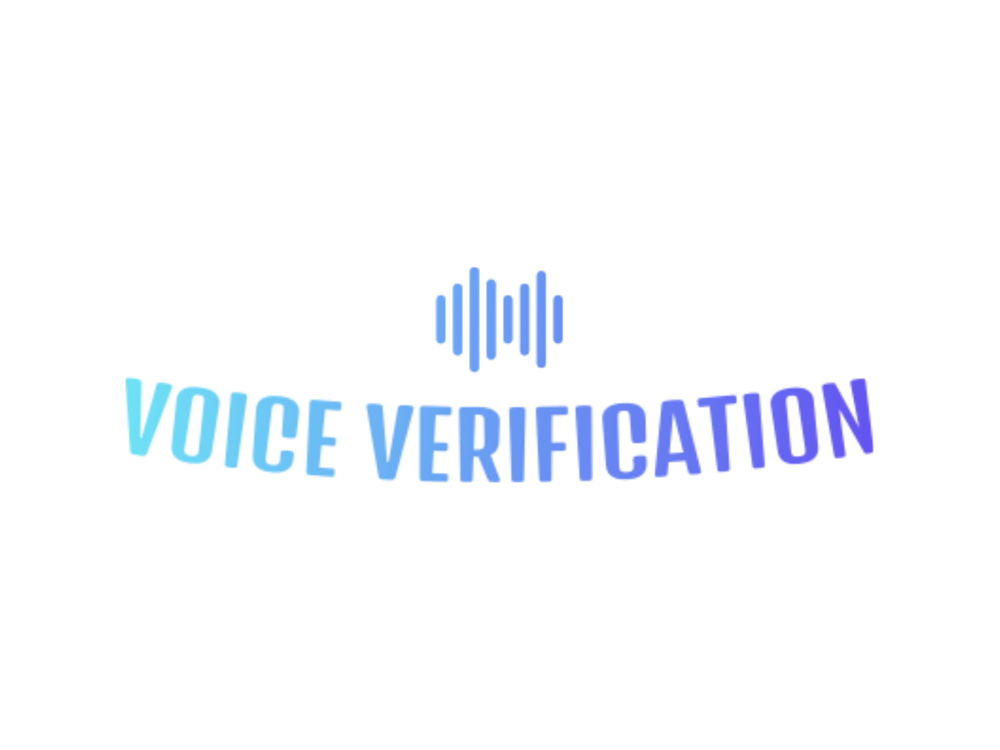

<p align="center">
<a href="https://github.com/your-username/voice-verification-system" target="_blank" rel="noreferrer">  </a>  
</p>

# Voice Verification System

### 🎙️ **A Simple Yet Powerful Voice Identity Verification Application**
This application, built using React and FastAPI, provides an intuitive and efficient way to register and verify user identities through voice comparison.

[](https://opensource.org/licenses/MIT)
[](./)
[](https://reactjs.org/)
[](https://fastapi.tiangolo.com/)

<p align="center">
<a href="https://reactjs.org/" target="_blank" rel="noreferrer">  </a>
<a href="https://fastapi.tiangolo.com/" target="_blank" rel="noreferrer">  </a>
<a href="https://www.sqlite.org/" target="_blank" rel="noreferrer">  </a>
</p>

</br>

<p align="center">
<a href="https://www.primefaces.org/primereact/" target="_blank" rel="noreferrer">  </a>
<a href="https://vitejs.dev/" target="_blank" rel="noreferrer">  </a>
<a href="https://github.com/pyannote/pyannote-audio" target="_blank" rel="noreferrer">  </a>
</p>

</br>

## Table of Contents

- [Voice Verification System](#voice-verification-system)
    - [🎙️ **A Simple Yet Powerful Voice Identity Verification Application**](#️-a-simple-yet-powerful-voice-identity-verification-application)
  - [Table of Contents](#table-of-contents)
  - [Screenshots](#screenshots)
  - [Introduction](#introduction)
  - [Key Features](#key-features)
  - [Architecture](#architecture)
      - [Frontend Structure](#frontend-structure)
      - [Backend Structure](#backend-structure)
  - [Installation](#installation)
  - [Usage](#usage)
  - [API Endpoints](#api-endpoints)
    - [User Management](#user-management)
    - [Audio Processing](#audio-processing)
    - [Detailed Endpoint Descriptions](#detailed-endpoint-descriptions)
      - [Register a New User](#register-a-new-user)
      - [Compare Voice Sample](#compare-voice-sample)
  - [Known Issues and Limitations](#known-issues-and-limitations)
  - [Contributing](#contributing)
  - [License](#license)
  - [Acknowledgments](#acknowledgments)

## Screenshots

<p align="center">
  
</p>

**Figure 1:** Adding a new user with voice sample

<p align="center">
  
</p>

**Figure 2:** Comparing a voice sample against registered users

<p align="center">
  
</p>

**Figure 3:** User management interface

<p align="center">
  
</p>

**Figure 4:** Voice embedding visualization using radar chart

<p align="center">
  
</p>

**Figure 5:** Full application demo showcasing key features

Introduction
------------
The Voice Verification System is a modern web application that allows users to register their voice and later verify their identity through voice comparison. It combines the power of React for the frontend and FastAPI for the backend to create a seamless and efficient user experience.

Key Features
------------
🎤 **Voice Registration**
- Users can register by providing personal information and a voice sample.
- Secure storage of user data and voice embeddings.
- Form validation ensures accurate and complete user information.

🔍 **Voice Comparison**
- Compare a new voice sample against registered users.
- Receive similarity scores and verification results.
- Dimensional visualization of voice embeddings for intuitive comparison.

👥 **User Management**
- Add new users through an intuitive form that has validation.
- View and manage registered users through an intuitive interface.
- Delete user profiles when necessary.

📊 **Data Visualization**
- Interactive radar chart displaying multi-dimensional voice embeddings.
- Adjustable number of dimensions for detailed analysis.

⏳ **Shimmer Loading**
- Smooth loading animations during data fetching and processing.
- Enhances user experience by providing visual feedback on loading states.

🖥️ **Responsive UI**
- Modern, responsive design using PrimeReact components.
- Intuitive navigation between different sections of the app.

⚡ **Fast and Efficient**
- Utilizes Vite for rapid development and optimized builds.
- FastAPI backend for high-performance API operations.

🔊 **Advanced Audio Processing**
- Leverages PyAnnote for sophisticated audio analysis and feature extraction.

🗃️ **Efficient Data Storage**
- Uses ChromaDB for vector storage, enabling fast similarity searches.
- SQLite database for structured data storage.

Architecture
------------

#### Frontend Structure

The React frontend is organized as follows:

```
voice-verification/
├── public/
├── src/
│   ├── components/
│   │   └── Navbar.css
│   │   └── VoiceComparisonChart.jsx
│   ├── pages/
│   │   ├── AddUserPage.jsx
│   │   └── ComparePage.jsx
│   │   └── UsersPage.jsx
│   │   └── NotFoundPage.jsx
│   ├── App.css
│   ├── App.jsx
│   └── main.jsx
├── index.html
├── package.json
├── package-lock.json
└── vite.config.js
```

#### Backend Structure

The FastAPI backend follows this structure:

```
backend/
├── app/
│   ├── api.py
│   ├── models/
│   │   ├── custom_exceptions.py
│   │   ├── user.py
│   │   └── pydantic_models.py
│   ├── repositories/
│   │   ├── user_repository.py
│   │   ├── chroma_repository.py
│   │   └── audio_repository.py
├── main.py
├── requirements.txt
```

Installation
-------------
[Provide detailed installation instructions here]

Usage
------
1. **Add User**: Navigate to the "Add User" page to register a new user with their voice sample.
2. **Compare Voice**: Use the "Compare" page to record a voice sample and compare it against registered users.
3. **Manage Users**: The "Users" page allows you to view and manage registered users.

API Endpoints
-------------

Our Voice Verification System provides a comprehensive set of RESTful API endpoints for user management and audio processing. Below is a detailed overview of the available endpoints:

### User Management

| Method | Endpoint | Description |
|--------|----------|-------------|
| `POST` | `/users` | Register a new user with voice sample |
| `GET`  | `/users/{user_id}` | Retrieve a specific user's information |
| `PUT`  | `/users/{user_id}` | Update a user's information |
| `DELETE` | `/users/{user_id}` | Delete a user |
| `GET`  | `/users` | Retrieve all registered users |
| `GET`  | `/users_with_embeddings` | Retrieve all users with their voice embeddings |

### Audio Processing

| Method | Endpoint | Description |
|--------|----------|-------------|
| `POST` | `/audio/process` | Process and save a new voice sample for a user |
| `POST` | `/audio/compare` | Compare a voice sample against a registered user |

### Detailed Endpoint Descriptions

#### Register a New User
```http
POST /users
```
- **Body**: `multipart/form-data`
  - `name`: string
  - `surname`: string
  - `email`: string
  - `audio`: file (voice sample)
- **Response**: User object with ID

#### Compare Voice Sample
```http
POST /audio/compare
```
- **Body**: `multipart/form-data`
  - `user_id`: integer
  - `file`: file (voice sample to compare)
- **Response**: Similarity score and voice embeddings

For detailed API documentation, including request/response schemas and example usage, please refer to our [API Documentation](http://localhost:8000/docs) when the server is running.

Known Issues and Limitations
----------------------------
[List any known issues or limitations of your project]

Contributing
------------
Contributions are welcome! Please feel free to submit a Pull Request.

License
-------
This project is licensed under the MIT License - see the [LICENSE](LICENSE) file for details.

Acknowledgments
---------------
- [PrimeReact](https://www.primefaces.org/primereact/) for UI components
- [PyAnnote](https://github.com/pyannote/pyannote-audio) for audio processing
- [ChromaDB](https://www.trychroma.com/) for vector storage
- [ChromaDB](https://www.trychroma.com/) for vector storage
- [ChromaDB](https://www.trychroma.com/) for vector storage
- [ChromaDB](https://www.trychroma.com/) for vector storage
- [ChromaDB](https://www.trychroma.com/) for vector storage
